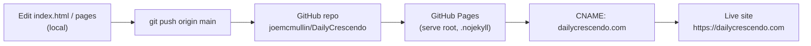
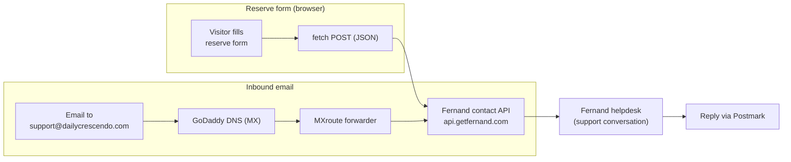

# Daily Crescendo — pre-launch landing site

Pre-launch landing and waitlist site for **Daily Crescendo**, an iPhone music-practice
journal (a timer that lives in the Dynamic Island, on-device AI session recaps, and a
practice/recording history that stays on the device — pay once, no subscription). The
site is pure static HTML/CSS/JS, deployed on GitHub Pages at **https://dailycrescendo.com**.

## What's in the repo

- `index.html` — single-file landing page (inline CSS + JS): animated hero with a live
  ticking timer mock, scroll-reveal sections, a scroll-reactive header (hidden over the
  hero, revealed past it), and the **reserve / founding-access waitlist form**.
- `privacy.html` · `terms.html` · `support.html` · `accessibility.html` — supporting pages.
- Animated **badge-style wave logo system**: `logo-mark.svg`, `logo-stacked.svg`,
  `logo-badge-static.svg`, `favicon.svg`.
- `og-card.html` + `og-image.png` — 1200×630 social/OG share card.
- `CNAME` (`dailycrescendo.com`) and `.nojekyll` — GitHub Pages custom-domain config.
- `Docs/email-routing.md` — pointer to the studio email-routing SOP (the contact-flow
  source of truth lives in the Apex vault, not in this repo).

There is **no build step, no framework, and no tracking/analytics** on the site.

## Local development

```bash
python3 -m http.server 8765   # from the repo root, then open http://localhost:8765
```

A persistent local preview also runs at **http://localhost:8776** via the
`com.joemcmullin.dailycrescendo` LaunchAgent.

## Deploy pipeline

Static-only. Pushing to `main` triggers GitHub Pages, which serves the repo root
(`.nojekyll` disables Jekyll) and maps the `CNAME` apex domain over HTTPS.



## Reserve form & contact flow

The waitlist form (`<form id="f">` in `index.html`) is submitted client-side: JS calls
`e.preventDefault()` and `fetch`-POSTs a JSON payload to the **Fernand** headless contact
API (`https://api.getfernand.com/messenger/contact`), which opens a support conversation
in the Fernand helpdesk. The qualifying answers (current tracking method, practice
frequency, switch reason, teacher flag, variant, `utm_source`) are folded into the
message body. On success the form is replaced inline with a "You're on the list"
confirmation; on failure it shows an error asking the visitor to email instead. There is
**no Formspree and no backend** — the page POSTs directly to Fernand from the browser.

Inbound email to **`support@dailycrescendo.com`** (used in the footer and on every
supporting page) is forwarded into Fernand per the studio SOP. As documented in
`Docs/email-routing.md`, this app's routing is **MX (GoDaddy DNS) → MXroute forwarder →
Fernand**, with outbound replies sent via Postmark.



> **Note:** the studio playbook records Daily Crescendo as a Cloudflare Email Routing
> pilot, but the in-repo `Docs/email-routing.md` describes the live setup as
> GoDaddy MX → MXroute → Fernand. This README reflects the in-repo doc; confirm the
> authoritative values in the Apex vault email-routing spec before changing DNS.

## Per-channel UTM

The form carries a hidden `utm_source` field (`REPLACE_PER_CHANNEL`) so demand-test
traffic can be segmented by channel. Set it per campaign before driving paid traffic.

---

Built by **Apex Development Studio LLC**. Pre-launch — not yet on the App Store.
